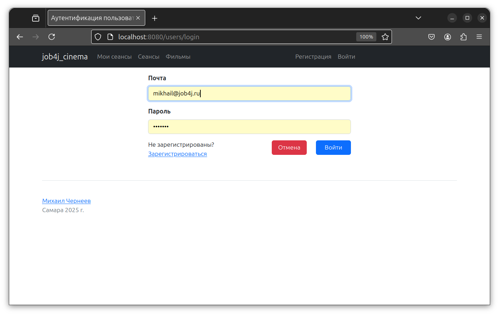
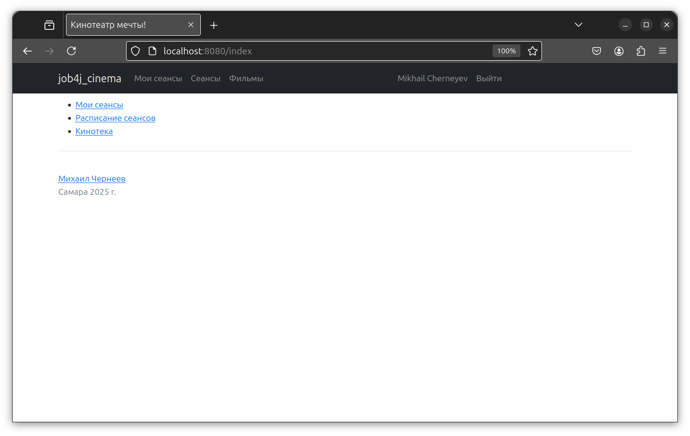
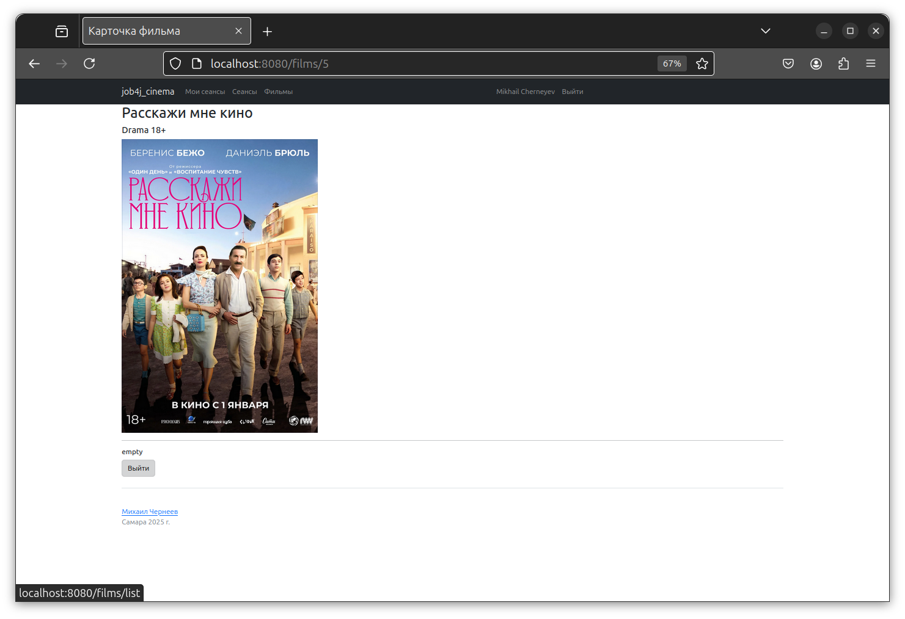
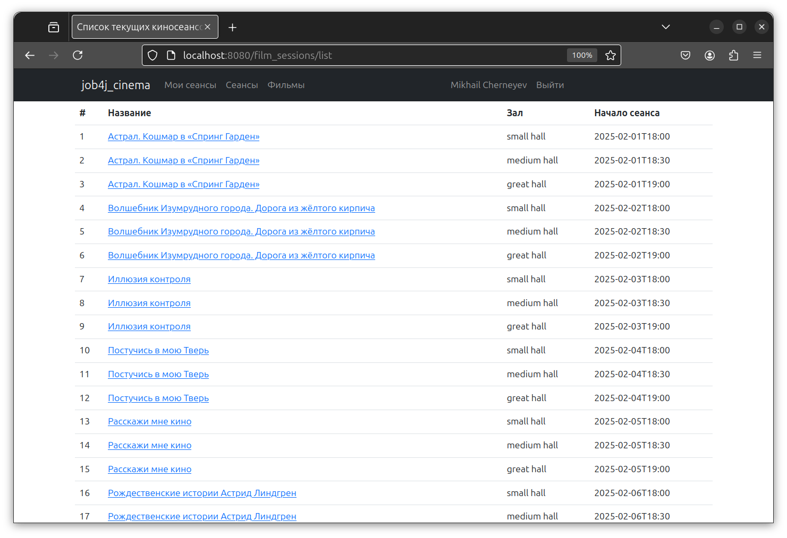
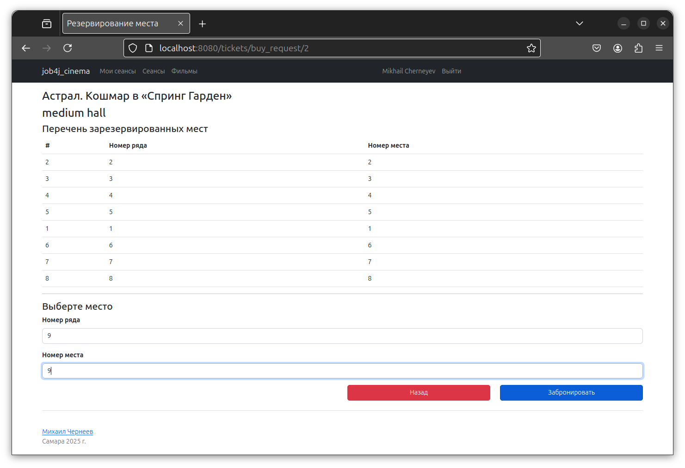
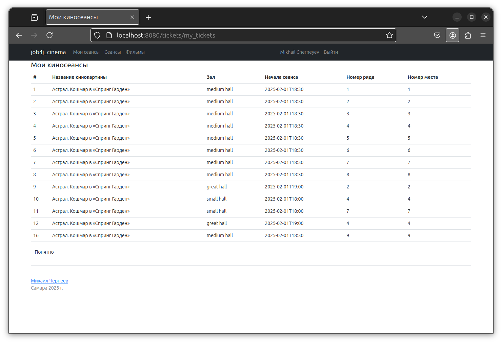

## Проект "Веб-Сервис КИНОТЕАТР".

### Описание задачи:
Цель проекта - разработка веб-приложения для бронирования билетов в кинотеатр.

Основной функционал включает:
+ Регистрацию и вход пользователя;
+ Просмотр расписания киносеансов и информации о фильмах;
+ Бронирование билетов с проверкой занятости мест;
+ Просмотр пользователем всех ранее забронированных билетов.


### Используемые технологии:
+ Java 17
+ Spring Boot
+ Thymeleaf
+ PostgreSQL

### Окружение:
+ Java 17
+ Maven
+ PostgreSQL

### Запуск приложения

1. Создайте базу данных PostgreSQL
``` sql
CREATE USER cinema WITH PASSWORD 'cinema';
CREATE DATABASE cinema
GRANT ALL PRIVILEGES ON DATABASE cinema to cinema;
```

2. Клонируйте репозиторий
``` bash
cd job4j_cinema
git clone https://github.com/MikhailChrn/job4j_cinema
```

3. Соберите проект с помощью Maven:
``` bash
mvn clean install 
```

4. Запустите приложение:
``` bash
mvn spring-boot:run
```
5. После запуска:
Проект доступен по адресу: [http://localhost:8080](http://localhost:8080)

### Взаимодействие с приложением

1. Вход



2. Главная



3. Фильмы



4. Сеансы



5. Бронирование места



6. Мои сеансы



### Контакты

mikhail.cherneyev@yandex.ru
